# Ejemplo práctico Apache HUDI

Ejemplo práctico inspirado en el siguiente [post](https://blog.arima.eu/es/2020/10/20/exprimiendo-tu-data-lake-parte-I-hudi.html), en el que se habla sobre la evolución de los sistemas de almacenamiento en entornos Big Data, más concretamente de los Data Lake, y como [Apache Hudi](https://hudi.apache.org) puede ayudar en su gestión.

## Objetivo

Descargar una gran cantidad de entradas de la Wikipedia y identificar aquellas que sean celebridades a través de un proceso en Apache Spark. El resultado almacenarlo en HDFS en archivos con formato Parquet haciendo uso de la herramienta Apache Hudi. Una vez completada esta operación, llevar a cabo una serie de actualizaciones sobre los datos, verificando que Hudi genera y compacta los nuevos archivos de manera eficiente, comprobando en cada operación su "lineage", para saber qué modificaciones han ido sufriendo.

## Pre-requisitos

* [Git](https://git-scm.com/book/en/v2/Getting-Started-Installing-Git)
* [Docker](https://docs.docker.com/get-docker)
* [Docker-compose](https://docs.docker.com/compose/install)

## Comenzando

Simularemos un cluster con la ayuda de la herramienta Docker (junto a docker-compose) para configurar y ejecutar los servicios necesarios:

* [HADOOP HDFS](https://hadoop.apache.org/docs/r1.2.1/hdfs_design.html) - Sistema de almacenamiento distribudio HDFS
* [APACHE HIVE](https://hive.apache.org) - Infraestructura de almacenamiento de datos construida sobre Hadoop para proporcionar agrupación, consulta, y análisis de datos
* [APACHE SPARK](https://hadoop.apache.org/docs/r1.2.1/hdfs_design.html) - Framework para la computación en un clúster
* [APACHE HUDI](https://hudi.apache.org) - Herramienta para ingerir y administrar el almacenamiento de grandes conjuntos de datos analíticos a través de sistemas de archivos distribuidos

## Ejercicio

A continuación se detallan los pasos para la consecución del ejercicio:

### PASO 1 - Clonar el proyecto de GitHub

~~~
git clone https://github.com/wearearima/hudi-exercise.git
~~~

### PASO 2 - Arrancar cluster simulado con Docker

En el archivo `docker-compose.yml` están definidos todos los servicios necesarios para poder simular este cluster con Docker. Para arrancarlo ejecutar el script:

~~~
./start.sh
~~~

### PASO 3 - Copiar todos los datos de la WIKI al sistema de archivos distribuido HDFS

~~~
docker exec -it namenode /bin/bash hdfs dfs -copyFromLocal /wiki /wiki
~~~

---
**NOTA**

Se puede comprobar que el contenedor `namenode` está arrancado con el comando: `docker exec -it namenode hdfs dfsadmin -report`

---

### PASO 4 - Obtención de celebridades con Apache Spark y guardarlo en HDFS (Parquet) con la herramienta Apache Hudi. 

Todo este proceso se encuentra en el archivo `./shared/spark-job/1-job.py`, y consta de dos partes importantes:

1. Filtrado y obtención de celebridades. Esta discriminación se realiza buscando en cada una de las entradas de la Wikipedia el primer texto que tenga formato de tipo fecha dentro de su contenido.

    ```python
    ...

    data = sc.wholeTextFiles("hdfs://namenode:8020/wiki/wiki_*")
    pages = data.flatMap(lambda x: (x[1].split('</doc>'))).map(lambda x: (get_title(x), get_date_timestamp(
        x), get_content(x))).filter(lambda x: ((len(x[0]) != 0) or (len(x[1]) != 0))).filter(lambda x: check_if_person(x[1]))
    df = pages.toDF(["title", "date", "content"])
    df = df.select('title', to_date(df.date, 'MM/dd/yyyy').alias('date'), "content")
    ```
    (INFORMATIVO) Esta parte dará como resultado un DataFrame `df` de Spark con el siguiente esquema:
    ~~~
    >>> df.printSchema()
    root
    |-- title: string (nullable = true)
    |-- date: date (nullable = true)
    |-- content: string (nullable = true)
    ~~~

2. Transformar el DataFrame `df` en archivos de tipo Parquet y guardarlos en el almacenamiento HDFS con la herramienta Apache Hudi.

    ```python
    tableName = "hudi_celebrities"
    basePath = "hdfs://namenode:8020/wiki/hudi_celebrities"

    hudi_options = {
        'hoodie.table.name': tableName,
        'hoodie.datasource.write.table.type': 'COPY_ON_WRITE',
        'hoodie.datasource.write.operation': 'upsert',
        'hoodie.datasource.write.recordkey.field': 'title',
        'hoodie.datasource.write.precombine.field': 'title',
        'hoodie.datasource.write.table.name': tableName,
        'hoodie.upsert.shuffle.parallelism': 2,
        'hoodie.insert.shuffle.parallelism': 2,
        'hoodie.datasource.write.keygenerator.class': 'org.apache.hudi.keygen.NonpartitionedKeyGenerator',
        'hoodie.datasource.hive_sync.enable': 'true',
        'hoodie.datasource.hive_sync.table': tableName,
        'hoodie.datasource.hive_sync.partition_extractor_class': 'org.apache.hudi.hive.NonPartitionedExtractor',
        'hoodie.datasource.hive_sync.jdbcurl': 'jdbc:hive2://hiveserver:10000'
    }

    df.write.format("hudi").options(**hudi_options).mode("overwrite").save(basePath)
    ```

    En la configuración de `hudi_options` hay que destacar los siguientes aspectos:

    * Tipo de tabla `COPY_ON_WRITE`, que es una de las opciones, junto a `MERGE_ON_READ`, que ofrece HUDI para gestionar sus tablas. Más información en su [documentación oficial](https://hudi.apache.org/docs/concepts.html#table-types).
    * Las propiedades del tipo `hoodie.datasource.hive...` configuran HUDI para que genere automáticamente una tabla en HIVE `hudi_celebrities`, con la que posteriormente poder realizar consultas tipo SQL sobre los datos.
    * Modo `overwrite` para que en caso de que ya exista la carpeta `hdfs://namenode:8020/wiki/hudi_celebrities` la elimine y vuelva a generar los datos desde el principio.

Ejecutar primer proceso:

~~~
docker exec -it adhoc-1 /bin/bash spark-submit \
--packages org.apache.hudi:hudi-spark-bundle_2.11:0.6.0,org.apache.spark:spark-avro_2.11:2.4.4 \
--conf 'spark.serializer=org.apache.spark.serializer.KryoSerializer' \
/var/hoodie/ws/spark-job/1-job.py
~~~

Las verificaciones del resultado del proceso se hacen dentro del contenedor `adhoc-1`:

~~~
docker exec -it adhoc-1 /bin/bash
~~~

Una vez dentro, comprobar que:

1. La biblioteca de HUDI administra de manera efectiva este conjunto de datos:

    - root@adhoc-1:/# `/var/hoodie/ws/hudi-cli/hudi-cli.sh`
    - hudi-> `connect --path hdfs://namenode:8020/wiki/hudi_celebrities`<br/><br/>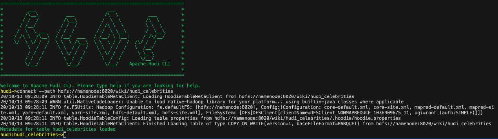

    A) Descripción de la tabla HUDI

    - hudi:hudi_celebrities-> `desc`<br/><br/>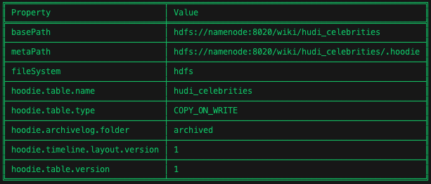
       
    B) Verificar primer commit

    - hudi:hudi_celebrities-> `commits show  --desc true`<br/><br/>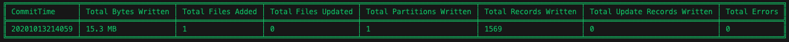
    <br/><br/>
    > **_NOTA:_**  Para salir del cliente HUDI: `exit`


### PASO 5 - Realizar modificaciones insert y update en el set de datos

Ejecutar un nuevo proceso que realice modificaciones sobre los datos. A diferencia del anterior este cargara un sólo archivo de texto con 2 celebridades:

1. Nueva celebridad que se añadirá a los datos actuales
2. Celebridad que ya existe, y por lo tanto, será modificada en el set de datos

El proceso se encuentra en el archivo `spark-job/2-job.py` y es igual al primero, exceptuando el modo de escritura, que en este caso es `append`:

```python
....

df.write.format("hudi").options(**hudi_options).mode("append").save(basePath)
```

Ejecutar segundo proceso:

~~~
docker exec -it adhoc-1 /bin/bash spark-submit \
--packages org.apache.hudi:hudi-spark-bundle_2.11:0.6.0,org.apache.spark:spark-avro_2.11:2.4.4 \
--conf 'spark.serializer=org.apache.spark.serializer.KryoSerializer' \
/var/hoodie/ws/spark-job/2-job.py
~~~

Las verificaciones del resultado del proceso se hacen dentro del contenedor `adhoc-1`:

~~~
docker exec -it adhoc-1 /bin/bash
~~~

Una vez dentro, comprobar que:

1. Se ha insertado una nueva celebridad (New Celebritie) y se ha modificado una existente (Clara Petacci):

    - root@adhoc-1:/# `$SPARK_INSTALL/bin/pyspark --driver-class-path /opt/hive/conf --packages org.apache.hudi:hudi-spark-bundle_2.11:0.6.0,org.apache.spark:spark-avro_2.11:2.4.4 --conf spark.sql.hive.convertMetastoreParquet=false`<br/><br/>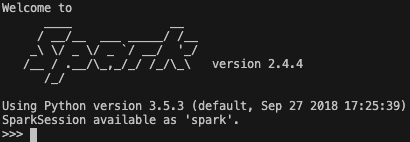
    - &#62;&#62;&#62; `spark.sql("select title, date, content from hudi_celebrities where title='New Celebritie'").show(1, False)`<br/><br/>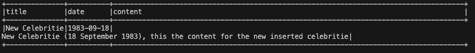
    - &#62;&#62;&#62; `spark.sql("select title, date, content from hudi_celebrities where title='Clara Petacci'").show(1, False)`<br/><br/>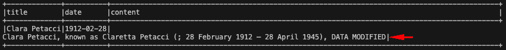
    - &#62;&#62;&#62; `exit()`

2. La biblioteca HUDI ha realizado toda la gestión automáticamente:

    - root@adhoc-1:/# `/var/hoodie/ws/hudi-cli/hudi-cli.sh`
    - hudi-> `connect --path hdfs://namenode:8020/wiki/hudi_celebrities`    

    A) Verificar segundo commit:

    - hudi:hudi_celebrities-> `commits show  --desc true`<br/><br/>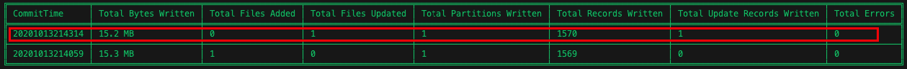
        
    B) Información del commit realizado

    - hudi:hudi_celebrities-> `commit showfiles --commit 20201013214314`<br/><br/>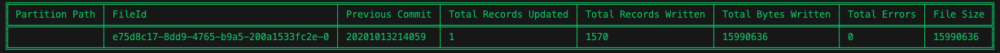
    <br/><br/>
    > **_NOTA:_**  Para salir del cliente HUDI: `exit`

### PASO 6 - Eliminar una de las celebridades del set de datos

Este proceso cargará un archivo de texto con la celebridad que se desea eliminar.

El proceso `./shared/spark-job/3-job.py`, es prácticamente el mismo a los anteriores, pero se configura de manera diferente para eliminar datos `hudi_delete_options`:

```python
....

hudi_delete_options = {
    'hoodie.table.name': tableName,
    'hoodie.datasource.write.table.type': 'COPY_ON_WRITE',
    'hoodie.datasource.write.operation': 'delete',
    'hoodie.datasource.write.recordkey.field': 'title',
    'hoodie.datasource.write.precombine.field': 'title',
    'hoodie.datasource.write.table.name': tableName,
    'hoodie.upsert.shuffle.parallelism': 2,
    'hoodie.insert.shuffle.parallelism': 2,
    'hoodie.datasource.write.keygenerator.class': 'org.apache.hudi.keygen.NonpartitionedKeyGenerator'
}
```

Ejecutar tercer proceso:

~~~
docker exec -it adhoc-1 /bin/bash spark-submit \
--packages org.apache.hudi:hudi-spark-bundle_2.11:0.6.0,org.apache.spark:spark-avro_2.11:2.4.4 \
--conf 'spark.serializer=org.apache.spark.serializer.KryoSerializer' \
/var/hoodie/ws/spark-job/3-job.py
~~~

Las verificaciones del resultado del proceso se hacen dentro del contenedor `adhoc-1`:

~~~
docker exec -it adhoc-1 /bin/bash
~~~

Una vez dentro, comprobar que:

1. Se ha eliminado la celebridad (Clara Petacci):

    - root@adhoc-1:/# `$SPARK_INSTALL/bin/pyspark --driver-class-path /opt/hive/conf --packages org.apache.hudi:hudi-spark-bundle_2.11:0.6.0,org.apache.spark:spark-avro_2.11:2.4.4 --conf spark.sql.hive.convertMetastoreParquet=false`
    - &#62;&#62;&#62; `spark.sql("select title, date, content from hudi_celebrities where title='Clara Petacci'").show(1, False)`<br/><br/>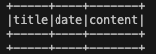
    - &#62;&#62;&#62; `exit()`

2. La biblioteca HUDI ha realizado toda la gestión automáticamente:

    - root@adhoc-1:/# `/var/hoodie/ws/hudi-cli/hudi-cli.sh`
    - hudi-> `connect --path hdfs://namenode:8020/wiki/hudi_celebrities`    

    A) Verificar tercer commit:

    - hudi:hudi_celebrities-> `commits show  --desc true`<br/><br/>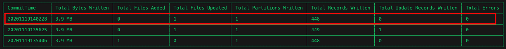
        
    B) Información del commit realizado

    - hudi:hudi_celebrities-> `commit showfiles --commit 20201013214621`<br/><br/>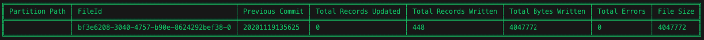
    <br/><br/>
    > **_NOTA:_**  Para salir del cliente HUDI: `exit`

### PASO 7 - Parar cluster simulado con Docker

Una vez terminado el ejercicio, borrar todos los contenedores que están simulando un cluster con Docker. Para pararlos ejecutar el script:

~~~
./stop.sh
~~~


## Conclusiones

Hemos visto como con Apache Hudi se pueden llegar a realizar operaciones de inserción, modificación y eliminación de los datos en archivos de tipo Parquet (y Avro, si trabajamos con el tipo de tabla `MERGE_ON_READ`) de manera eficiente, sin tener que preocuparse de la gestión de estos archivos. Además ofrece metadata adicional para tener un <i>lineage</i> completo de las modificaciones que han sufrido. El ejemplo se ha basado en un ejercicio práctico en el que se ha utilizado el módulo `hudi-spark` que ofrece una <i>API Datasource</i> con el que se puede escribir (y leer) un Dataframe de Spark en una tabla Hudi. No obstante, dispone de otro módulo llamado <i>DeltaStreamer</i> con el que se puede trabajar con fuentes de streaming, como puede ser Apache Kakfa. Puede encontrar más información [aquí](https://hudi.apache.org/docs/writing_data.html).


